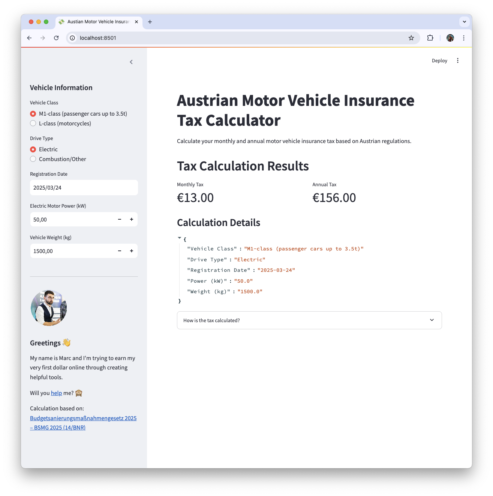

# Austrian Motor Vehicle Insurance Tax Calculator

A Streamlit application that calculates the monthly and annual motor vehicle insurance tax based on Austrian regulations.

## Overview

This calculator helps Austrian vehicle owners determine their motor vehicle insurance tax (motorbezogene Versicherungssteuer) based on various vehicle parameters. The calculator supports different vehicle types, drive systems, and registration dates, implementing the tax formulas as defined in the Austrian Versicherungssteuergesetz (Insurance Tax Act).
Calculation based on: [Budgetsanierungsmaßnahmengesetz 2025 – BSMG 2025 (14/BNR)](https://www.parlament.gv.at/dokument/XXVIII/BNR/14/fnameorig_1671984.html).



## Features

- Calculate tax for different vehicle classes:
  - M1-class (passenger cars up to 3.5t)
  - L-class (motorcycles)
- Support for different drive types:
  - Electric vehicles
  - Combustion/Other engines
- Tax calculation based on:
  - Registration date (before or after October 1, 2020)
  - Vehicle power (kW)
  - Vehicle weight (for electric M1 vehicles)
  - Engine displacement (for motorcycles)
  - CO2 emissions (for newer vehicles)
- Detailed calculation breakdown
- Responsive user interface

## Installation

1. Clone this repository:
```bash
git clone https://github.com/yourusername/austrian-vehicle-tax-calculator.git
cd austrian-vehicle-tax-calculator

2. Install the required dependencies:
```bash
pip install -r requirements.txt
 ```

## Usage
Run the Streamlit app:

```bash
streamlit run streamlit_tax_calculator.py
 ```
```

Then open your browser and navigate to the URL displayed in the terminal (typically http://localhost:8501 ).

## How to Use
1. Select your vehicle class (M1-class or L-class)
2. Choose your drive type (Electric or Combustion/Other)
3. Enter your vehicle's registration date
4. Provide the required vehicle specifications based on your selections
5. View the calculated monthly and annual tax amounts